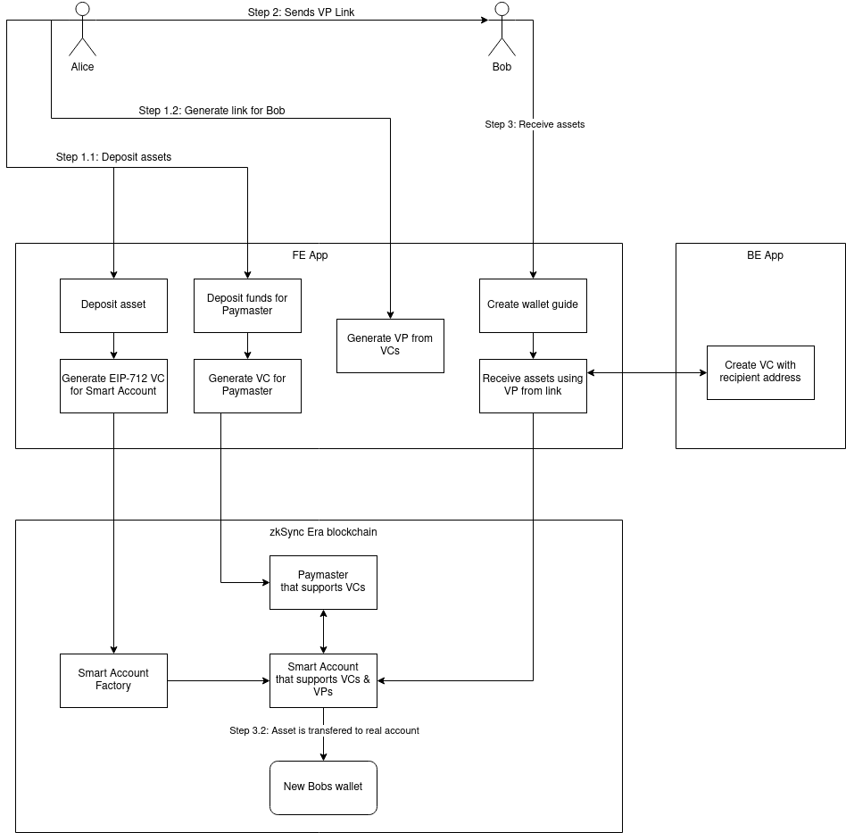

# Chalcedony - Bearer Vouchers for crypto assets

Chalcedony is a set of zkSync contracts and Web App that allows users to transfer crypto assets via sending links.

## Implementation details

Under the hood, Chalcedony, for each transfer, Chalcedony:

* using [Onyx SSI SDK](https://github.com/jpmorganchase/onyx-ssi-sdk) creates a DID and issues a Verifiable Credential for a Smart Account 
* funds custom zkSync Paymaster and - using Onyx SSI SDK - issues a Verifiable Credential that allows funding transactions using this Paymaster
* deploys a Smart Account based on zkSync Account Abstraction, that can be controlled by anyone that presents a proper Verifiable Credential

VerifiableCredentials are encoded and passed to the recipient as an URL. Recipient then uses these to:

* control the Smart Account
* authorize payment for the transaction by Paymaster

### Implemented custom technologies

#### EIP712Service for Onyx SSI SDK

As of the time of writing this, stock Onyx SSI SDK only supports JSON Web Tokens (JWT) as a proof mechanism via the builtin `JWTService`. As JWTs are prohibitively expensive to process on-chain, we've decided to implement an Onyx SSI SDK compatible service that implements [Ethereum EIP712 Signature 2021](https://w3c-ccg.github.io/ethereum-eip712-signature-2021-spec/). Ethereum EIP712 Signature 2021 is a draft of standard for creating Verifiable Credential proofs that are cheap to validate on-chain.

[Click here to see our EIP712Service](./EIP712Service/src/index.ts)

#### Smart Account controlled by Verifiable Credential

We've implemented an zkSync Account Abstraction based Smart Account contract, that can be used by providing a Verifiable Credential issued for this Smart Account.

[Click here to see the Smart Account contract](./contracts/contracts/Account.sol).

#### Paymaster based on Verifiable Credentials

Similarly to the Smart Account, we've implemented a zkSync Custom Paymaster, that will pay for the transaction if it's provided with a correct Verifiable Credential.

[Click here to see the Paymaster contract](./contracts/contracts/Paymaster.sol).

### Application flow

[Click here to see details of Verifiable Credentials and complete description of the flow](./schemas/credentials.md).

### Tech Roadmap

#### Support for Ethereum EIP712 Signature 2012 Proof Representation

Although we do use EIP712 signatures, we transfer the `proofValue` separately to the VCs in non-standard format. Support for the [standardized representation](https://w3c-ccg.github.io/ethereum-eip712-signature-2021-spec/#proof-representation) is on the roadmap.

#### Zero-knowledge protocol for preventing front-running

Currently we utilize a trusted backend as a witness provider for preventing front-running and replay attacks - as otherwise anyone could copy the VC from chain/mempool and do their own transactions without having the magic link.

This can be easily solved by introducing a zero knowledge protocol that will proof that the transaction issuer knows the correct VC without revealing it. This is on the roadmap.

#### Proper support for ethr DID method

Although we do use `did:ethr`, as Onyx SSI SDK only supports ES256K keys for this method, we don't actually support checking the DID Registry. This is on the roadmap.

#### Supporting multicalls

When initiating token transfer, Alice must do multiple transactions to the chain:
* deploying Smart Account
* funding paymaster
* transfering tokens to the Smart Account

All of these should be done in a single transaction via a multicall contract.

## Testnet deployment

`main` branch is automatically deployed to https://chalcedony.vercel.app/. It's configured to work on [zkSync Era Testnet](https://era.zksync.io/docs/dev/building-on-zksync/interacting.html#connecting-to-zksync-era-on-metamask).

## Local dev quick start

1. Install deps:
    * [Node.js](https://nodejs.org/) - CI tests on v18, but any newer should be fine too
    * [Yarn](https://yarnpkg.com/getting-started/install) - `corepack enable` should be enough to install it
    * [Docker Engine](https://docs.docker.com/engine/install/), including docker compose plugin
2. Clone repo: `git clone --recurse-submodules git@github.com:neti-software/chalcedony.git`
    * if you cloned without submodules, run `cd chalcedony && git submodule update --init` to fetch them
3. Start [zkSync dev nodes](https://github.com/matter-labs/local-setup/blob/main/README.md)
    * `cd chalcedony/local-setup && docker compose up -d`
4. Setup [our frontend app](./app/README.md)
    * `cd chalcedony/app && cp .env.example .env && yarn && yarn run dev`
4. Setup [our backend app](./witness-backend/README.md)
    * `cd chalcedony/witness-backend && yarn && yarn run dev`
5. Setup [our contracts](./contracts/README.md)
    * follow Quick start guide in linked README.md
